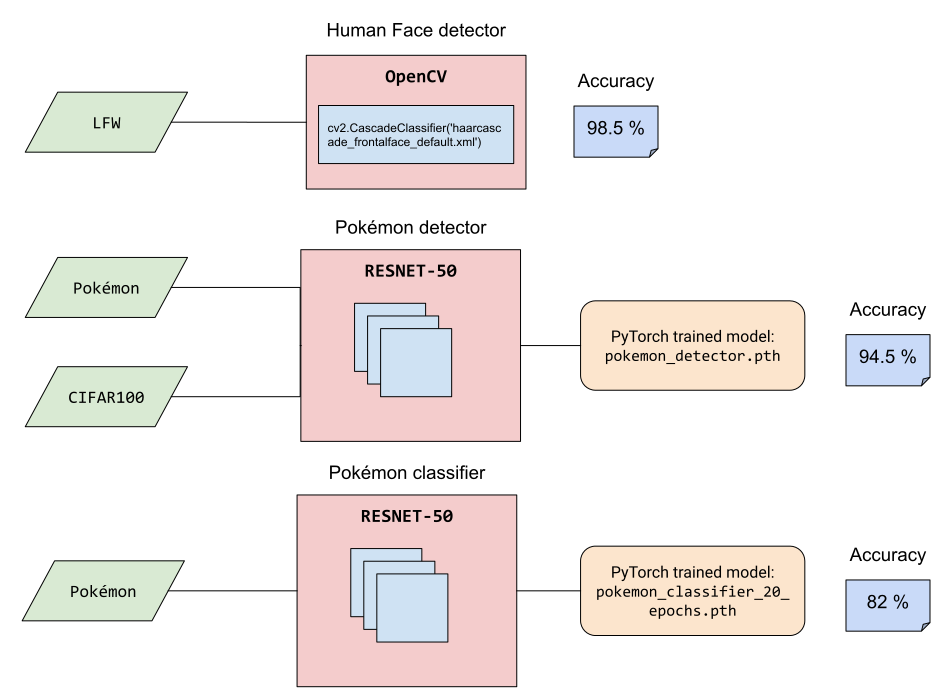
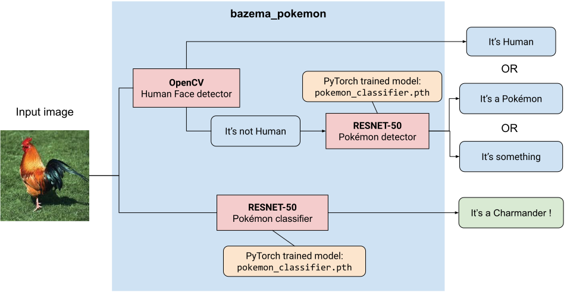

&nbsp;&nbsp;&nbsp;&nbsp;&nbsp;&nbsp;&nbsp;&nbsp;&nbsp;&nbsp;&nbsp;&nbsp;&nbsp;&nbsp;&nbsp;&nbsp;&nbsp;&nbsp;&nbsp;&nbsp;&nbsp;&nbsp;&nbsp;&nbsp;&nbsp;&nbsp;

Pokémon classifier
==================


# Project overview

This project aims to classify images as Pokémon. When the input image is a Pokémon, the algorithm will respond the
Pokémon name. When the input image is a human face or anything else, the algorithm will respond which Pokémon you
lookalike.

Inspired by [CNN Project: Dog Breed Classifier](https://github.com/udacity/deep-learning-v2-pytorch/tree/master/project-dog-classification)

### Technical environment
- OpenCV
- PyTorch
- CNN
- Transfer Learning
- Image classification
- Colab

### Datasets
- [Labeled Faces in the Wild Home](http://vis-www.cs.umass.edu/lfw/lfw.tgz).
  This dataset will be used to evaluate a human face detector.
- [Pokemon Generation One](https://www.kaggle.com/lantian773030/pokemonclassification). 
  This dataset will be used to train and evaluate a Pokémon detector and a classifier of Pokémon species.
- [CIFAR-100](https://www.cs.toronto.edu/~kriz/cifar-100-python.tar.gz).
  This dataset will be used to train the Pokémon detector, providing examples not representing Pokémon.

### Training workflow



### Prediction workflow



# Usage

## Docker (recommended)

```shell
# Assuming you have an image named "pika.jpg" in the current directory
docker run -v $PWD:/app bameza/bazema_pokemon:latest --image_path pika.jpg
```

## Local development

#### Requirements
Python >= 3.6

```shell
virtualenv -p python3.8 venv && source venv/bin/activate
make install
make linter

bazema_pokemon --image_path pika.jpg
```


### Resources

- https://pytorch.org/tutorials
- https://towardsdatascience.com/how-to-train-an-image-classifier-in-pytorch-and-use-it-to-perform-basic-inference-on-single-images-99465a1e9bf5?gi=f8b2c41eddbc
- https://curiousily.com/posts/transfer-learning-for-image-classification-using-torchvision-pytorch-and-python/
- https://lionbridge.ai/articles/end-to-end-multiclass-image-classification-using-pytorch-and-transfer-learning/
- https://medium.com/@011ivand3r/pytorch-pokedex-70ad86f42568


### Todo
- make docker image smaller