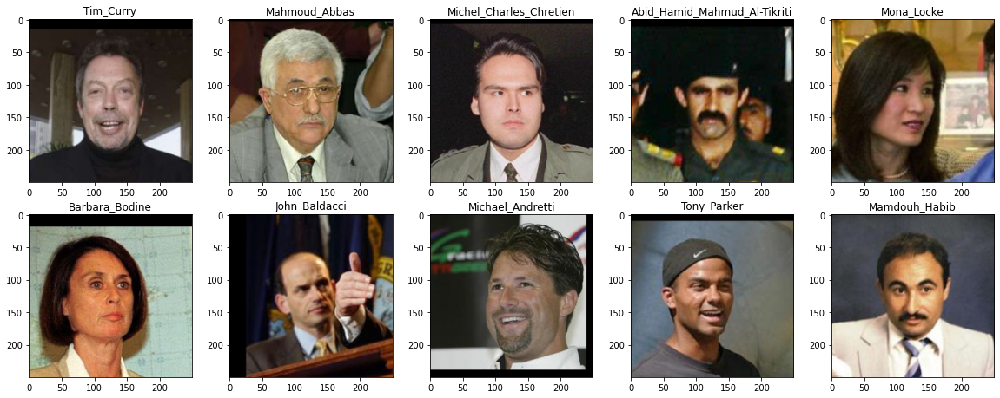
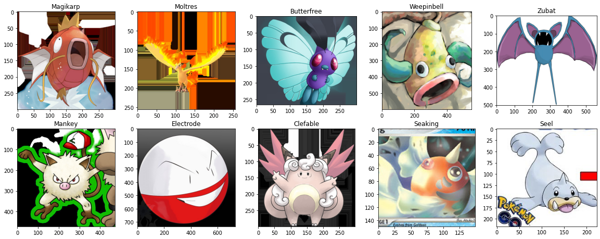
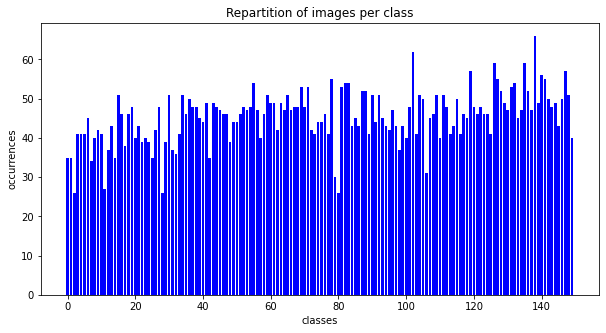
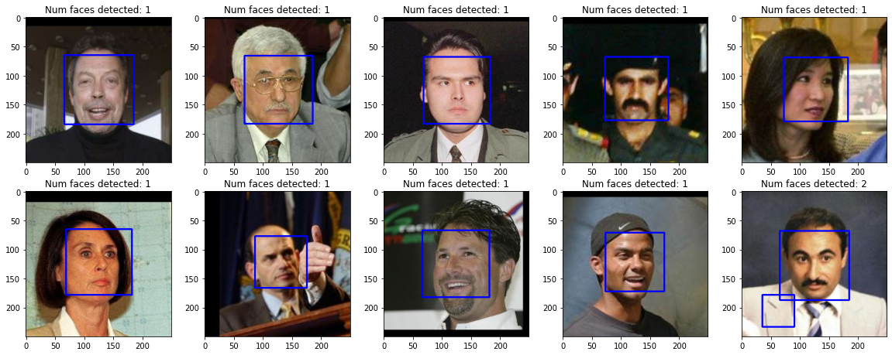
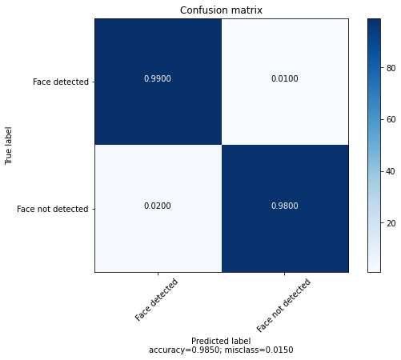
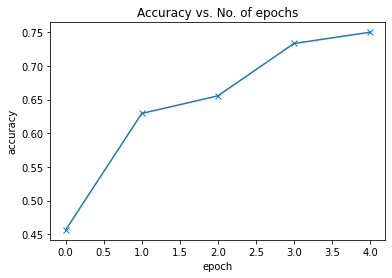
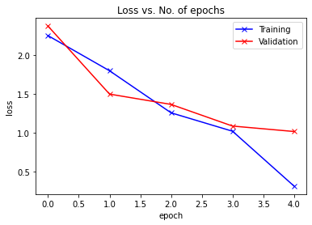

Project report - bazema_pokemon
===============================

Baptiste Azéma  
February 21st, 2021

# Pokémon classifier

## Domain Background

Pokémon are creatures that inhabit the fictional Pokémon World. Each creature has unique design and
skills. We will focus on
the [Generation One](https://en.wikipedia.org/wiki/List_of_generation_I_Pok%C3%A9mon) featuring the
original 151 fictional species of creatures introduced in the 1996 Game-Boy games "Pokémon".

As our world is becoming more and more bizarre, a future were Pokémon and Humans coexist might be
possible. We might need some tool to identify if a photo shows a Pokémon, a human, and which Pokémon
it looks like.

## Problem Statement

This project aims to classify images as Pokémon species. When the input image is a Pokémon, the
algorithm will respond the Pokémon name. When the input image is a human face or anything else, the
algorithm will respond if it's human and which Pokémon it looks like.

Inspired by
udacity's [CNN Project: Dog Breed Classifier](https://github.com/udacity/deep-learning-v2-pytorch/tree/master/project-dog-classification)

## Datasets

### Datasets

- [Labeled Faces in the Wild Home](http://vis-www.cs.umass.edu/lfw/lfw.tgz). This dataset will be
  used to evaluate a human face detector.
- [Pokemon Generation One](https://www.kaggle.com/lantian773030/pokemonclassificationone). This
  dataset will be used to train and evaluate a Pokémon detector and a classifier of Pokémon species.
- [CIFAR-100](https://www.cs.toronto.edu/~kriz/cifar-100-python.tar.gz). This dataset will be used
  to train the Pokémon detector, providing examples not representing Pokémon.

# Designed solution

Our algorithm need to take 3 decisions:

- is it human ?
- is it a Pokémon ?
- which Pokémon looked like this ?

The first item will be answered with [OpenCV](https://github.com/opencv/opencv). The second and
third items will be answered using the machine learning
library [PyTorch](https://github.com/pytorch/pytorch)
and reinforcement learning in order to create 2 models.

## Technical environment

- OpenCV
- PyTorch
- CNN
- Transfer Learning
- Image classification
- AWS SageMaker

## Training workflow

## Prediction workflow 

# Data exploration

## lfw

There are 13233 total human images. One face in each picture and each face is different.

We can see that we have every human races represented in the dataset.

## Pokémon

There are 6837 total Pokémon images. One Pokémon in each picture.

Number of Pokémon species in the dataset: 150. We miss 1 Pokémon in our dataset (Gen 1 is about 151
Pokémon), but we will ignore this issue

We have multiple representations of every Pokémon. This will enable us to recognize a Pokémon specie
even for new pictures.

#### Repartition of images per class

Standard deviation is about 7. 
The repartition between classes is not perfect, but it will be ok.

## CIFAR-100

There are 50000 total CIFAR images. Number of classes: 100. One object or animal in each picture.

Standard deviation is 0. 
The repartition between classes is perfect.

With this dataset we have many exemples of objects, animal, plants, vehicles, etc… 
We will use it to detect if an input image is a Pokémon or something else.

# Prototyping

## Detect human faces

We use OpenCV to detect a human face, and more precisely a Haar-cascade of classifier which uses a
decision tree to detect a human face in the image.

We use a pretrained cascade classifier named `haarcascade_frontalface_alt` provided by OpenCV.

As we can see, our tool detects well the faces with few false positives.

### Performance

To mesure the performance of this solution, we build a dataset of 200 images: 100 human faces and
100 images of Pokémon. The following confusion matrix shows the performance.

It works quite well ! It detects well when the image is a human face 99% of the time and 98% of the
time when it's not a human face. We have very few False-Positives and False-Negatives.

## Detect Pokémon

In order to detect Pokémon among images, we need to train a model with images of Pokémon and images
of other classes. 
We will use transfer learning in order to speed up the training process.

Our problem is a classification with 2 classes: "Pokémon", "Other".

- "Pokémon" dataset represents the class "Pokémon"
- "CIFAR100" dataset represents the class "Other"

### Algorithm
This is an image classification problem. Convolutional neural network are a good choice here.

We use a pre-trained Resnet50 provided by PyTorch to speed-up the learning phase.

### Dataset

We split our datasets to training and testing. We use all the Pokémon dataset but just a random
subset of the CIFAR100 dataset as we need to have the same mount of exemples for both classes.

|dataset|total|training|testing|
|---|---|---|---|
|Pokémon|6837|5797|1023|
|Cifar100|6800|5800|1000|

We use the following image augmentation :
- RandomResizedCrop(size=64)
- RandomHorizontalFlip()
- RandomRotation(degrees=15)
- Normalize(mean_nums=[0.485, 0.456, 0.406], std_nums=[0.229, 0.224, 0.225])

The data prepareted for training is as follows:

### Performance

As shown in the graphic below, our accuracy per class computed on the test set is good: 91% for
Pokémon and 98% for Others.
Thus, our final application should be able to detect if the image is a Pokémon or not.

#### Result examples

## Pokémon classifier

In order to classify Pokémon images, we need to train a model with images of Pokémon and images of
other classes. 
We will use transfer learning in order to speed up the training process.

Our problem is a classification with 150 classes, each for per Pokémon species.

- "Pokemon" dataset

### Algorithm

This is an image classification problem. Convolutional neural network are a good choice here.

We use a pre-trained Resnet50 provided by PyTorch to speed-up the learning phase.

### Dataset
We use the "Pokémon" dataset here. Each species is a class, i.e. we have 150 classes.

We split our datasets to training and testing.

|dataset|total|training|validation|testing|
|---|---|---|---|---|
|Pokémon|6837|5456|1376|1024|

We use the following image augmentation :
- RandomResizedCrop(size=300)
- RandomHorizontalFlip()
- RandomCrop(size=256)
- RandomPerspective()
- RandomRotation(degrees=15)
- Normalize(mean_nums=[0.485, 0.456, 0.406], std_nums=[0.229, 0.224, 0.225])

The data prepared for training is as follows:

### Modeling

We use a pretrained resnet50 provided by PyTorch. We fix all layers expect the final layer.

We use [colab](https://colab.research.google.com/) and the provided GPU for training (Nvidia Tesla T4)

We use 3 subset of the data:
- train set for actually training the model
- validation set to compute metric during the training
- test set to compute accuracy after training on new data

### Performance

#### Performance on the validation set

#### Performance after training on the test set
Try to predict on new data:

> Accuracy of the network on the test images: 82 %

The accuracy of the model on new images is 82%. 
This is correct and we can now move to our final application.

# Final application

Our final application is written in Python and uses:
- the OpenCV `haarcascade_frontalface_alt` pretrained classifier
- our `pokemon_detector.pth` model trained
- our `pokemon_classifier.pth` model trained

The usage is pretty simple, you can run it with docker. 
You can check the [prediction_workflow](#prediction_workflow) for the detailed process. 

Exemple usage

    > docker run -v $PWD:/app bameza/bazema_pokemon:latest \
      --image_path pokemon.jpg
    I guess it's a Pokemon: Abra !
    Took 0:00:00.219980 to predict

# Futur improvements

- benchmark more models
- hyperparameter tuning
- automated training pipeline
- more data augmentation
- use AWS SageMaker for a more "production-ready" implementation
- add unit tests
- CI/CD pipeline to build/test/deploy